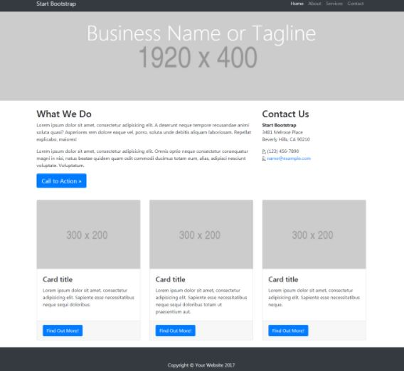
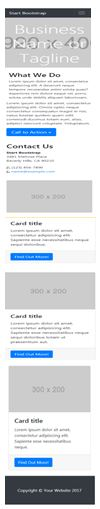
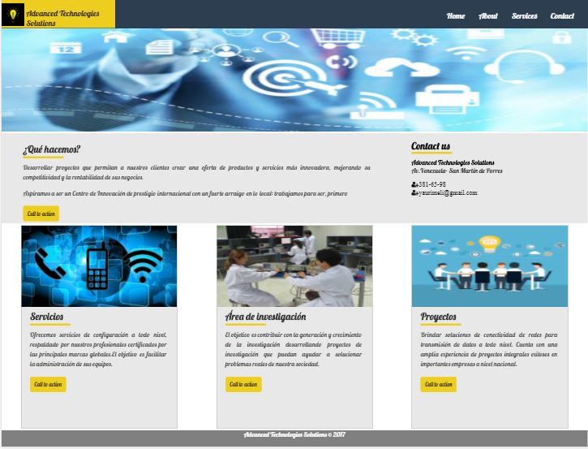
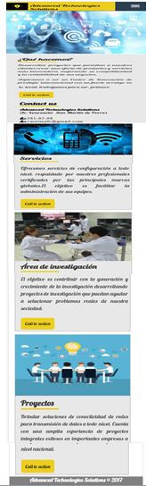

# Reto-Mi Página
## Autora: Melissa Yauri

#Objetivo
Realizar un página web como se desee pero se debe de mantener la estructura de la página. Y realizarlo con un grid, que sea cualquiera pero que no sea un framework como Bootstrap o Materialize. La estructura de la página es la siguiente:

* Version desktop

* Version mobile

#Resultado

El resultado que se obtuvo es una página web para una empresa llamada Advanced Technology Solutions que se encarga de brindar servicios de telecomunicaciones y asimismo tiene su centro de investigación.

En la página web se utilizo la herramientas como el `sistema de grillas` para establecer el contenedor, columnas y filas que se organzirán según el tamaño de pantalla que use el usuario.También se utilizó la herramienta `media queries`para que se cambien los estilos definidos segun el tamaño de la pantalla.Las versiones se muestran de la siguiente manera:

* Version desktop

* Version mobile

